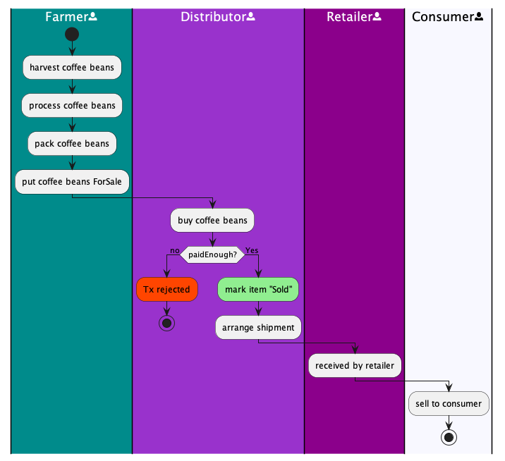
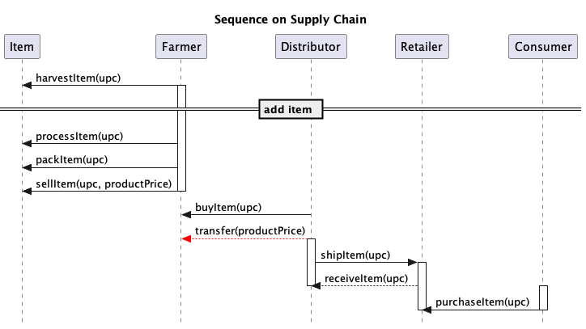
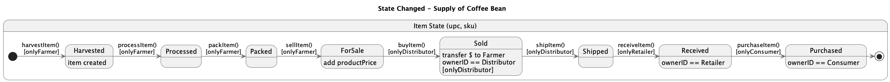
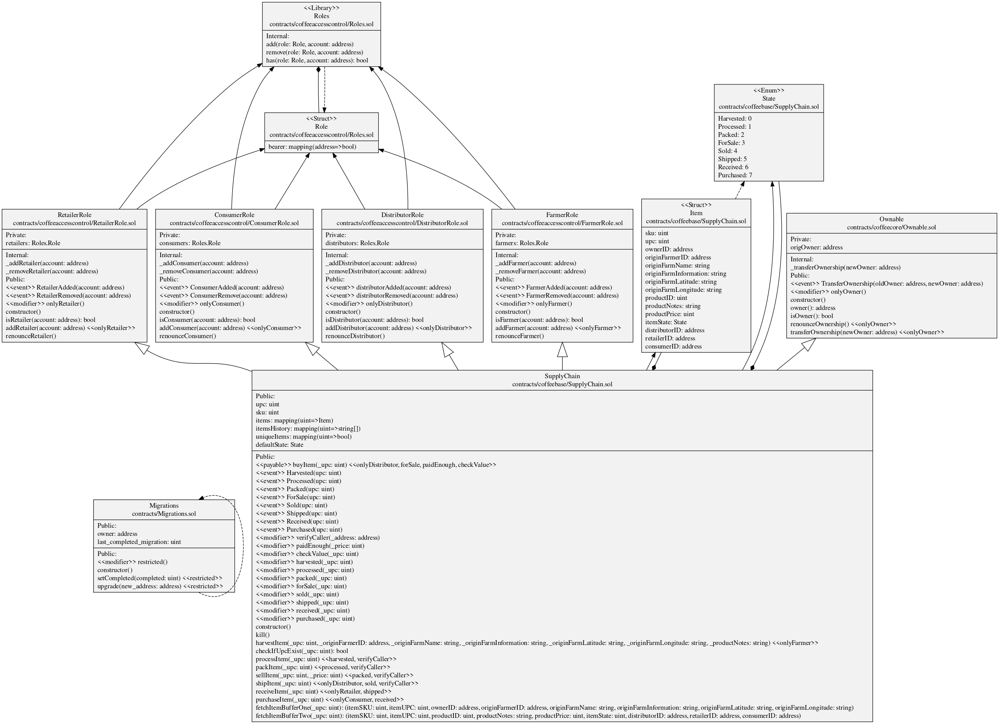

## Supply Chain - Coffee Beans

This repository containts an Ethereum DApp that demonstrates a Supply Chain flow of Coffee Beans between a Seller and Buyer. The user story is similar to any commonly used supply chain process. A Seller can add items to the inventory system stored in the blockchain. A Buyer can purchase such items from the inventory system. Additionally a Seller can mark an item as Shipped, and similarly a Buyer can mark an item as Received.

This DAPP proves the authenticity of ownership of product from its origin, farmer, through consumer with immutable record on Ethereum Blockchain.  Both frontend and backend are decentralised to warrant a 24/7 operation. 

## Getting Start

Create a new directory as project folder and install all requisite npm packages (as listed in package.json):
	
	cd project-6
	npm install
	
	
### Libraries
Basic libraries for this repository can be installed via **npm install** <<library name>> and they are installed either under global or local environment.
 
1. Global envirnoment
	
	- Truffle v5.6.2 (core: 5.6.2)
	- Solidity - 0.6.0 (solc-js)
	- Node v16.17.0


2. Local environment
	- web3.js v1.8.0
	- ganache-cli v6.12.2
	- dotenv v16.0.3
	- truffle/hdwallet-provider@2.0.17

3. Other libraries
	- npm link sol2uml --only=production (for generating class UML automatically)


4. Decentralized Backend and Frontend
	This DApp is built on Ethereum network which stores record for public access. Transaction record including the DApp program code (smart contract) once deployed are immutable.  Please Goerli Test Network which is the network this DApp is running on.  
	Frontend of DApp was deployed using IPFS gateway and file storage system.  IPFS is a decentralized web hosting service. The site can be up and running 24/7.


### Launch Ganache

5. For a pre-determined development environment, please use: 

	ganache-cli -m "spirit supply whale amount human item harsh scare congress discover talent hamster"


	Your terminal should look something like this:

	

### Truffle - Compile, Migrate & Test 
	
6. In a separate terminal window, Compile smart contracts:

	```
	truffle compile
	```

	Your terminal should look something like this:

	

	This will create the smart contract artifacts in folder ```build\contracts```.

	Migrate smart contracts to the locally running blockchain, ganache-cli:

	```
	truffle migrate
	```

	Your terminal should look something like this:

	

	### Test smart contracts:

	```
	truffle test
	```

	All 10 tests should pass.

	

	In a separate terminal window, launch the DApp:

	```
	npm run dev
	```

	In a separate terminal window, Compile smart contracts:

	```
	truffle compile
	```

	Your terminal should look something like this:

	

	This will create the smart contract artifacts in folder ```build\contracts```.

	Migrate smart contracts to the locally running blockchain, ganache-cli:

	```
	truffle migrate
	```

	Your terminal should look something like this:

	

	Test smart contracts:

	```
	truffle test
	```

	All 10 tests should pass.

	

	In a separate terminal window, launch the DApp:

	```
	npm run dev
	```
### UML
This Coffee Bean DApp is a platform for the following participants:

	a) Farmer;
	b) Distributor;
	c) Retailer; and
	d) Consumer 

Accounts from the above categories approved by smart contract of the platform can participate in transacting on this platform. DApp records the stages of transaction as well as the ownerID of the product.  
	
The architect of DApp and its relevant business logic are illustrated in these UML for ease of reference.  

1. Activity Diagram </br> </br>

2. Sequence Diagram </br> </br>
	
3. State Diagram </br> </br>

4. Class Diagram </br> </br>

	
## Built With

	* [Ethereum](https://www.ethereum.org/) - Ethereum is a decentralized platform that runs smart contracts
	* [IPFS](https://ipfs.io/) - IPFS is the Distributed Web | A peer-to-peer hypermedia protocol
	to make the web faster, safer, and more open.
	* [Truffle Framework](http://truffleframework.com/) - Truffle is the most popular development framework for Ethereum with a mission to make your life a whole 		lot easier.

## Final Output
Etherscan : [Contract Address](https://goerli.etherscan.io/address/0x3F8Ee2517c2b68E9721cA0eaAF64e7992457656a)
	</br>
UI : [IPFS-SupplyChain](https://ipfs.io/ipns/k51qzi5uqu5dld2eef4i1m3jiingwf01w1169sh53utjw0j3m8tpnc4zbg7tgu/)

Transaction record.

| State        | Etherscan record           | Participant |
| ------------- |:-------------:| -----:|
| col 3 is      | right-aligned | $1600 |
| col 2 is      | centered      |   $12 |
| zebra stripes | are neat      |    $1 |

There must be at least 3 dashes separating each header cell.
The outer pipes (|) are optional, and you don't need to make the 
raw Markdown line up prettily. You can also use inline Markdown.

Markdown | Less | Pretty
--- | --- | ---
*Still* | `renders` | **nicely**
1 | 2 | 3
## Authors

See also the list of [contributors](https://github.com/your/project/contributors.md) who participated in this project.

## Acknowledgments

	* Solidity
	* Ganache-cli
	* Truffle
	* IPFS
